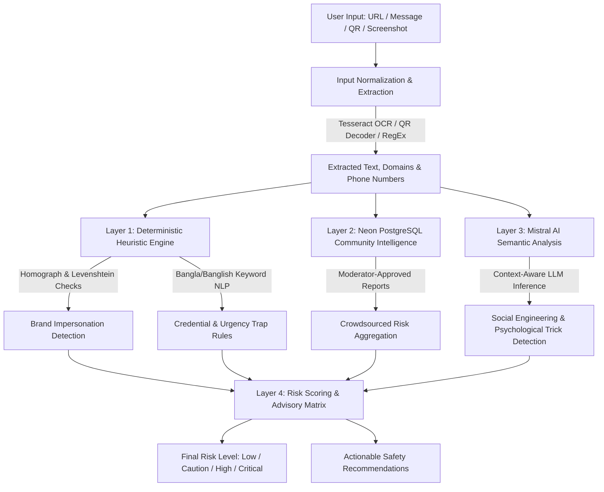

# SafeLink AI 🛡️

**Before You Click, Let AI Check.**  
*An AI-Powered, Multi-Layered Cyber Safety & Anti-Phishing Defense Platform for Bangladesh.*

[](https://safelink-ai-8q6c.onrender.com)
[](https://github.com/NoorAbdullah02/SafeLink-AI/releases/download/v1.0.0/app-debug.apk)
[](https://github.com/NoorAbdullah02/SafeLink-AI/actions)
[](LICENSE)

---

## 🌟 Overview & Problem Statement

In Bangladesh, Mobile Financial Services (MFS) like **bKash, Nagad, and Rocket** have empowered millions, but have also opened the floodgates to digital financial fraud:
- **Typo-squatting and Homograph attacks:** Spoofed domains such as `bkash-reward.xyz` or Unicode look-alike characters deceiving uninitiated users.
- **Social Engineering in Banglish / Regional Bangla:** Fake lottery claims, urgent threats (*"Apnar account ekhoni bondho hoye jabe"*), and unauthorized OTP/PIN harvesting.
- **Malicious QR codes & phishing screenshots:** Scams disguised as merchant pay codes or utility bills.

**SafeLink AI** provides a unified **Web + Flutter Mobile** defense system that analyzes links, messages, real QR codes, and screenshots through a 4-layered defense pipeline with privacy-first architecture.

---

## 🚀 Live Access

- 🌐 **Web Dashboard:** [https://safelink-ai-8q6c.onrender.com](https://safelink-ai-8q6c.onrender.com)
- 📱 **Android App (Direct APK):** [Download Latest APK v1.0.0](https://github.com/NoorAbdullah02/SafeLink-AI/releases/download/v1.0.0/app-debug.apk)
- 💻 **GitHub Repository:** [NoorAbdullah02/SafeLink-AI](https://github.com/NoorAbdullah02/SafeLink-AI)

---

## 🔬 Multi-Layered Defense Pipeline (How It Works)

SafeLink AI does not simply query a single black-box model. It employs a **4-Layer Defense Pipeline**:



### The 4 Stages Explained:

1. **Input Normalization & Extraction:**
   - **URL:** Normalizes domains, extracts subdomains, strips queries, catches userinfo tricks (`user@malicious.com`).
   - **Message:** Extracts Bangladeshi phone numbers (`+8801...`) and links; normalizes Bangla Unicode (NFKC).
   - **QR Code:** Decodes payload via `MobileScanner` / `jsqr` without opening destination.
   - **Screenshot:** Runs dual-language OCR (**Tesseract.js** in English + Bengali).
2. **Layer 1: Local Heuristic Rules Engine (Privacy-Preserving):**
   - Runs client/edge-compatible deterministic checks without sending raw data to external servers.
   - Computes **Levenshtein Distance** & skeleton normalization against trusted brand registries (bKash, Nagad, Brac Bank, etc.).
   - Identifies credential harvesting (requests for OTP, PIN, password) and urgency pressure (*"জরুরি"*, *"immediately"*, *"account blocked"*).
3. **Layer 2: Community Intelligence (Neon Cloud PostgreSQL):**
   - Cross-references targets with crowdsourced scam reports verified by community moderators.
   - Employs strict deduplication to prevent brigade abuse.
4. **Layer 3: Mistral AI Semantic Language Analysis:**
   - Interprets subtle contextual fraud in English, Bangla, and Banglish.
   - Generates natural-language reasoning explaining *why* the content is dangerous.
5. **Layer 4: Risk Scoring & Actionable Advisory (0–100):**
   - Aggregates signals into an intuitive index:
     - 🟢 **Low Risk (0–24):** No strong indicators found.
     - 🟡 **Caution (25–49):** Suspicious signals present; manual verification required.
     - 🟠 **High Risk (50–74):** Clear scam markers detected; do not proceed.
     - 🔴 **Critical Risk (75–100):** Severe threat/phishing detected; destination blocked.

---

## 🛠️ Technology Stack

| Layer | Technology |
|---|---|
| **Web Client** | React 19, Vite, TypeScript, Tailwind CSS, Radix UI, Lucide Icons |
| **Mobile Client** | Flutter 3 (Android & iOS), Dart, MobileScanner, Secure Storage |
| **Backend API** | Node.js, Express, TypeScript, Helmet, Express-Rate-Limit, Zod |
| **Database & ORM**| Neon Serverless PostgreSQL, Drizzle ORM |
| **AI / Machine Learning** | Mistral AI (`mistral-small-latest`), Tesseract.js (OCR) |
| **Email & Alerts** | Brevo (formerly Sendinblue) Transactional HTTPS API |
| **CI / CD & Cloud** | GitHub Actions (Auto APK Releases & CI), Render Cloud Hosting |

---

## 🎯 Competition Demo Showcase (Judges' Cheat-sheet)

To test the system live during a presentation, try these scenarios:

| Scenario | Input Content | Expected Detection |
|---|---|---|
| **bKash Typo-Squatting** | `https://bkash-reward.xyz/login` | 🔴 **Critical Risk:** Brand Impersonation, Suspicious TLD suffix |
| **Banglish Urgency Trap** | `Apnar bKash account bondho hoyeche! 10 min er moddhe PIN pathan.` | 🟠 **High Risk:** Credential theft (PIN request), Psychological urgency |
| **Bangla Prize Scam** | `অভিনন্দন! আপনি ৫০,০০০ টাকার লটারি জিতেছেন। ফি দিতে টাকা পাঠান।` | 🟠 **High Risk:** Fake prize claim, Upfront payment request |
| **Safe Official Link** | `https://www.bkash.com` | 🟢 **Low Risk:** Official verified brand domain |

---

## 💻 Local Development Setup

### Prerequisites
- **Node.js 22.12+** and **pnpm 10+**
- **Flutter SDK 3.x** (for mobile development)

```sh
# Clone repository
git clone https://github.com/NoorAbdullah02/SafeLink-AI.git
cd SafeLink-AI

# Install dependencies
pnpm install

# Configure environment
cp .env.example .env
# Edit .env with your DATABASE_URL, MISTRAL_API_KEY, BREVO_API_KEY

# Run database migrations
pnpm db:migrate

# Start web and API servers
pnpm dev
```

### Running Automated Test Suite
```sh
pnpm test
```
*All 29 integration and heuristic unit tests execute deterministically in ~4 seconds.*

### Building Mobile App
```sh
cd mobile
flutter pub get
flutter build apk --debug
```

---

## 🔒 Security & Privacy by Design

- **Zero-Execution Destination Policy:** SafeLink **never** follows links, executes remote scripts, or renders untrusted external web pages on the server (complete protection against Server-Side Request Forgery - SSRF).
- **In-Memory Image Processing:** Screenshots and QR images are processed strictly in RAM and never saved to persistent disk.
- **Cryptographic Security:** Salted scrypt password hashing, opaque mobile bearer tokens, HttpOnly/SameSite session cookies.
- **Auditable Moderation:** Admin audit trails for community scam reports and security alerts.

---

## 👥 Authors & Recognition

Developed for cyber-safety innovation and national digital financial literacy in Bangladesh.  
Repository maintained by [Noor Abdullah](https://github.com/NoorAbdullah02).

*License: MIT*
